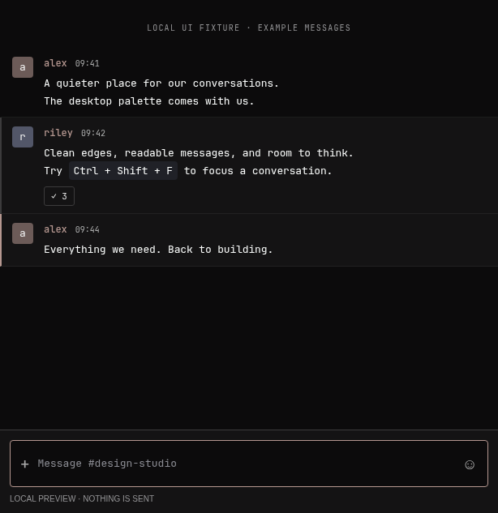

# OmaDisc

A multi-pane Discord web workspace for **Omarchy / Linux**. Choose **1, 2, 4 or 6** channels in one window. Normal Discord sign-in; messages remain authored by you.

*Preview uses local test fixtures.*

## Use

Launch **OmaDisc** from your application launcher or run `omadisc`.
1. Open **Settings (⚙) → Discord account → Sign in to Discord**. Complete sign-in in the single Discord window that opens. All channel panes reuse that saved session, including after restarting OmaDisc. Waiting channels reconnect automatically. Existing OmaDisc logins are reused; QR login, passwords and two-factor verification stay on Discord’s page. If you close the sign-in window, return to Settings whenever you are ready.
2. Choose 1 / 2 / 4 / 6 in the toolbar.
3. Click **+** in a pane header. Paste the full Discord channel link, or **Browse Discord** and select a channel inside Discord. Give it an optional label.
4. The toolbar channel menu follows the active pane. In a server channel it lists every accessible channel from that server, including collapsed categories and off-screen rows; choose one to open it in the same pane. **Focus pane** temporarily expands a chat and **Back to grid** restores your layout. Use page scale 65% / 80% for dense layouts.
5. **Omarchy** appearance follows your active desktop palette and changes while the app is open. Choose **Dark** or **Light** to override it. Channels use the **Omarchy chat design** by default: compact message rows, monospace text, square avatars and a minimal composer. Selected channels fill the pane with messages and the composer; Discord’s server/channel lists, account controls, duplicate headers and member panel are hidden. Use **☰** in a pane header to reveal Discord navigation and members, then **←** to return to chat. Choosing a channel through Discord or the + dialog returns to chat automatically. A pane on Discord Home keeps navigation until you select a conversation. Turn off **Use Omarchy chat design** in Settings for the original Discord view.

The six pane assignments, labels, layout, scale, appearance and Discord theme preference persist. Reducing a layout hides rather than destroys already-open panes, keeping in-memory drafts alive until you quit. Newly empty panes do not load Discord until you choose a channel. One dedicated persistent session shares login across the Settings account window and every pane. Signing in never changes your layout; signed-out panes show a Settings prompt. Repeated sign-in clicks focus the existing account window. Sign-in coordination reloads waiting or signed-out panes while preserving already-open channel drafts; Reload remains available if Discord fails to reconnect.

## Keyboard

| Shortcut | Action |
| --- | --- |
| Ctrl+Alt+1 / 2 / 4 / 6 | Layout |
| Ctrl+L | Choose channel in active pane |
| Ctrl+Shift+F | Focus pane / restore |
| Alt+1 … 6 | Focus a pane |
| Ctrl+R | Reload active pane |
| Escape | Exit focus mode / dismiss dialog |

Hyprland or Discord shortcuts can take precedence. All actions are also visible in the UI.

## Install from source

Requires Linux, Node >=22.12, npm, a C compiler (`cc`), normal Electron desktop libraries, and `desktop-file-validate`. Dependencies are locked. No sudo or system package modification:

    git clone https://github.com/kzndk/omadisc.git
    cd omadisc
    npm ci
    npm run check
    npm test
    npm run build
    npm run install:local

The standalone bundle is in `dist/omadisc-0.5.1-linux-<architecture>/`. The build uses the architecture of the machine on which npm installed Electron; ARM64 and x86_64 must be built/tested separately. Local install creates `~/.local/share/omadisc/releases/`, a `current` symlink, `~/.local/bin/omadisc`, and a desktop entry/icon. An existing same-version release is intentionally not overwritten. Close the app before replacing/removing an installed release.

## Data and security

- Official `https://discord.com` pages in separate sandboxed Electron WebContentsViews and a sandboxed account BrowserWindow sharing the same session. Optional CSS provides the Omarchy channel layout and colors. A fixed DOM scanner collects channel links for the toolbar menu by temporarily expanding collapsed categories and scrolling the channel list, then restoring the original category and scroll state. It does not access Discord stores, tokens or private APIs. There is no remote preload, patched client, self-bot, token extraction or iframe-header bypass.
- Remote content has no Node or preload bridge. Only the local custom-protocol shell can invoke validated workspace actions.
- Login/session data stays in OmaDisc's dedicated Chromium profile, normally `~/.config/omadisc/Partitions/discord/`. This is sensitive browser data; protect your Linux account and disk. Do not share or commit this profile. OmaDisc does not promise application-level encryption for Discord local storage.
- `~/.config/omadisc/workspace.json` contains only settings, labels and channel URLs (private permissions and atomic writes). The desktop palette is read from `~/.local/state/omarchy/current/theme/colors.toml`, with the legacy `~/.config/omarchy/current/theme/colors.toml` as a fallback; XDG directory overrides are respected. Discord still maintains its own browser cache. No third-party telemetry or server is added by OmaDisc.
- Only Discord HTTPS top-level navigation is allowed inside panes. Other HTTPS links require confirmation and open in your default browser. Other URL schemes are blocked. Downloads use a native Save dialog; files are never automatically executed.
- No blanket microphone, camera, screen sharing, device or clipboard-read permissions. Manual keyboard paste uses normal Chromium behavior.
- Chromium site isolation, sandbox, certificate checking, CSP and web security remain enabled. No exposed debug listener in a normal installed launch.

## Limits / status

### ARM SME-without-SVE compatibility

The ARM64 bundle includes an app-local compatibility library for CPUs exposing SME without SVE (including this Apple-hosted QEMU environment). Electron 44.3.0's bundled libyuv can execute `CNTD` before entering streaming mode, causing a `SIGILL` in its video compositor. The library suppresses SME-family optimization dispatch for this exact feature combination, retaining NEON and unrelated CPU capabilities. It neither disables the Chromium sandbox nor patches your system/browser. It is scoped to the adjacent OmaDisc runtime and is inert in unrelated processes that inherit its environment. Always start with `omadisc`, not the internal `omadisc-bin`, so the compatibility loader is active. Source: `src/native/`; regression test: `tests/native.test.cjs`.

This is an independent **text-first browser workspace**, not a Discord-endorsed replacement client. The Discord website supplies chat/history/uploads/reactions; authenticated behavior must be checked after sign-in. Voice, video, screen sharing and desktop notifications are not enabled. Other browser/site limitations, CAPTCHAs, login policies and Discord layout changes still apply. Six pages use considerably more RAM/CPU than one; we make no lightweight-client claim. The Omarchy chat design runs over Discord's own message list and editor; it is not an independent API client. Its presentation uses semantic attributes and CSS-module prefixes, and may need updates when Discord changes its website. Login and home retain navigation, and unrecognized layouts are left intact. Switch off the design in Settings if needed. OmaDisc does not synchronize channel caches outside Discord or restore unsent drafts after a full quit.

## Verification

    npm test
    npm run test:e2e
    npm run test:live

Tests require a running systemd user session with memory-controller support and `dbus-run-session`. Run suites sequentially. The test commands run in a separate service, capped at 768 MiB / 120 seconds for unit tests and 1536 MiB / 300 seconds for E2E or live checks, with swap disabled for that service. Electron checks use a private D-Bus session without service activation to prevent Chromium from moving its main process outside the memory limit. They assert that Electron remains in the test cgroup. Desktop portal integrations are not covered by this isolated harness. If a test exhausts its allowance, the test service fails independently of the development terminal. Test filters can be passed with `npm test -- --test-name-pattern='pattern'`. Keep large binary comparisons boolean (`buffer.equals(other)`) so failures cannot generate enormous assertion diffs.

E2E needs a desktop display (X11/XWayland for the Playwright harness). It launches the real Electron application with a temporary profile, intercepting Discord **only within the test harness** with clearly labelled fixture pages. It verifies layout, independent native panes, draft retention, focus/modal geometry, navigation validation, security preferences, scale, Settings sign-in, cancellation/retry, session expiry, cookie and local-storage sharing across new/waiting panes and a full restart, account-window isolation/shutdown, live theme changes, channel-only geometry, navigation toggling, draft preservation while switching views, theme opt-out and relaunch persistence. These fixtures are not proof of real authenticated Discord messages. `npm run test:live` uses a temporary profile on Wayland to reach the actual Discord sign-in page, check render stability and confirm that six assigned panes wait for the one Settings sign-in window. It does not enter credentials or send messages. Set `OMADISC_TEST_EXE` to a bundle's `omadisc` launcher and `OMADISC_TEST_APP` to its `resources/app` directory to verify that bundle.

## Remove

Close OmaDisc, then remove its launcher, desktop entry, icon and `~/.local/share/omadisc` installation. Keep `~/.config/omadisc` to preserve login/settings, or remove it separately if you intend to erase the dedicated browser profile. Never point removal at another browser's profile.

Not affiliated with, endorsed by, or sponsored by Discord. Discord is a trademark of its owner.
